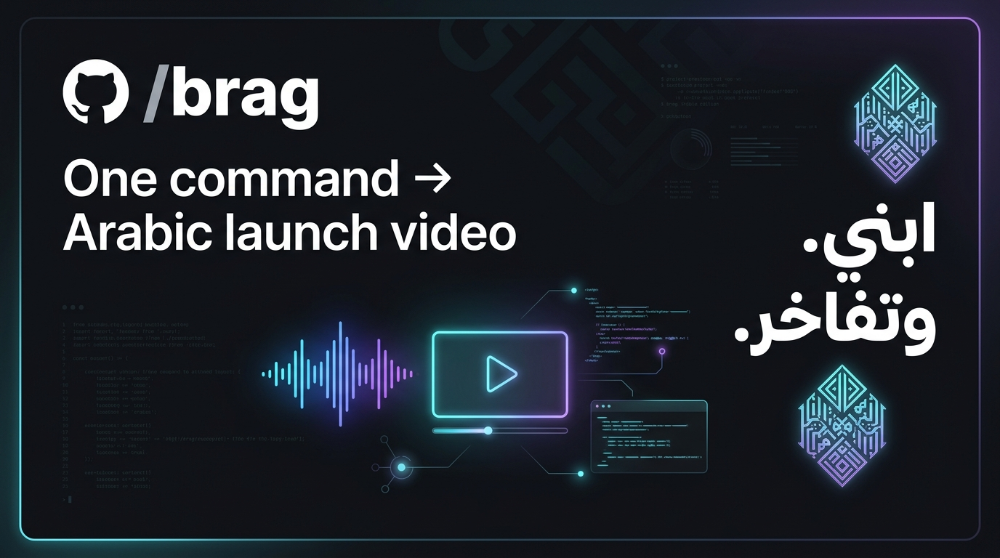

<p align="center">
  
</p>

<p align="center">
  <a href="https://opensource.org/licenses/MIT"></a>
  <a href="https://github.com/latent-spaces/brag"></a>
  <a href="#"></a>
  <a href="#"></a>
  <a href="#"></a>
</p>

# /brag — Arabic Edition | النسخة العربية

**You built it. Now brag — in Arabic.**  
**بنيته. والآن تفاخر.**

An AI coding agent skill that turns the project you just created into a short, shareable launch video — with all text, copy, and narration in Arabic. One command, powered by [Hyperframes](https://hyperframes.heygen.com/).

> 🔗 **Original Project:** This is the Arabic localization of [/brag](https://github.com/latent-spaces/brag) by [latent-spaces](https://github.com/latent-spaces). Check out the original English repository [here](https://github.com/latent-spaces/brag).

---

## Who is this for?

**Everyone.** You don't need to speak Arabic to use this.

- 🧑‍💻 **Arabic-speaking developers** who want to brag about their work in their language
- 🌍 **Any developer** who wants to show off their project to Arabic-speaking stakeholders, clients, or audiences
- 🎬 **Content creators** targeting Arabic social media (X/Twitter عربي, LinkedIn عربي, etc.)

## What it does

1. Reads your project code (in any language)
2. Understands what you built
3. Creates a short (15-25s) launch video with **Arabic text overlays, share copy, and narration**
4. Outputs a postable video with music, motion, and Arabic share copy

## Install

### Google Antigravity

Auto-detected from `.agents/skills/brag/` at project root or `~/.gemini/config/skills/brag/` globally.

### Claude Code

```bash
# Copy the skill
cp -r skills/brag/ ~/.claude/skills/brag/
```

### Any agent via the skills CLI (Cursor, Codex, Copilot, Gemini CLI, opencode, and more)

```bash
npx skills add https://github.com/Mostafa-Khazindar/brag-arabic --skill brag
```

Add `-g` to install globally (available in every project); drop it to scope to the current one.

### Manual copy

```bash
# For Antigravity
cp -r skills/brag/ ~/.gemini/config/skills/brag/

# For Claude Code
cp -r skills/brag/ ~/.claude/skills/brag/

# For opencode
cp -r skills/brag/ .opencode/skills/brag/
```

## Download audio assets

The skill uses CC0 music and SFX from the original brag project. Download them:

```bash
python scripts/download_assets.py
```

Or with a custom skill directory:

```bash
python scripts/download_assets.py --skill-dir ./skills/brag
```

Preview what would be downloaded:

```bash
python scripts/download_assets.py --dry-run
```

## Usage

Run `/brag` inside any project:

```
/brag
/brag --tone polished
/brag --dialect egyptian
/brag --dialect gulf --tone cinematic
/brag --format vertical --dialect levantine
/brag --voice --dialect msa
```

### Dialect support | دعم اللهجات

| Flag | Dialect | Description |
|---|---|---|
| `--dialect msa` (default) | فصحى حديثة | Modern Standard Arabic — professional, universally understood |
| `--dialect egyptian` | عامية مصرية | Egyptian Arabic — warm, conversational, widely understood |
| `--dialect gulf` | خليجي | Gulf Arabic — professional with Gulf flavor, for GCC audiences |
| `--dialect levantine` | شامي | Levantine Arabic — modern, conversational |
| `--dialect "your description"` | custom | Any freeform description of the Arabic register you want |

### Example Output | مثال حي لما يتم توليده

Here is what `/brag --tone polished --dialect msa` generates for a sample audio task app:

```markdown
# خطة التفاخر | Brag Plan: صوتي (Sawti)

- النبرة | Tone: مصقول (Polished)
- اللهجة | Dialect: فصحى حديثة (MSA)
- الفكرة الأساسية | Core Concept: من فكرة مبعثرة إلى خطة عمل منجزة في ثوانٍ.

### المشاهد | Scenes:
1. المشهد الأول (الخطاف):
   - النص العربي: "أفكارك تضيع بين التسجيلات؟" (Afkaruk tadi' bayn al-tasjilat?)
   - الإيقاع: سريع وحاسم مع مؤثر بصري خاطف.

2. المشهد الثاني (الحل):
   - النص العربي: "صوتي يحوّل تسجيلك الصوتي إلى مهام منظمة فوراً." 
     (Sawti yuhawwil tasjilak al-sawti ila maham munazzama fawran.)

3. المشهد الثالث (دعوة للتجربة):
   - النص العربي: "جرّبه الآن مجاناً — الرابط في الوصف."
     (Jarribhu al-an majjanan — al-rabit fil-wasf.)
```

### Options

| Option | Values | Default |
|---|---|---|
| `--tone` | `default`, `polished`, `yc-parody`, `chaotic`, `deadpan`, `cinematic`, `app-store`, or freeform | inferred |
| `--format` | `landscape`, `vertical`, `square` | `landscape` |
| `--duration` | seconds | auto (15-25s) |
| `--dialect` | `msa`, `egyptian`, `gulf`, `levantine`, or freeform | `msa` |
| `--no-music` | flag | music on |
| `--no-sfx` | flag | sfx on |
| `--title` | string | inferred from project |
| `--voice` | flag | narration off |

## Agent compatibility | التوافق مع الوكلاء

| Agent | How it discovers |
|---|---|
| **Google Antigravity** | Auto-detects from `.agents/skills/brag/` at project root or `~/.gemini/config/skills/brag/` globally |
| **opencode** | Auto-detects from `.opencode/skills/brag/` at project root |
| **Codex CLI** | Reads `.agents/skills/brag/`, walking up to repo root |
| **Claude Code** | Reads `.claude/skills/brag/` |
| **Other agents** | Point custom instructions at `skills/brag/SKILL.md` |

> **Windows users:** Git may require `git config core.symlinks true` before cloning if you use symlinks.

## Credits | شكر وتقدير

- Original [/brag](https://github.com/latent-spaces/brag) by Shunit Haviv Hakimi / [latent-spaces](https://github.com/latent-spaces) — MIT License
- Audio assets: CC0 from [Kenney.nl](https://kenney.nl/) and [OpenGameArt](https://opengameart.org/)
- Video rendering: [Hyperframes](https://hyperframes.heygen.com/)
- Arabic fonts: [Noto Kufi Arabic](https://fonts.google.com/noto/specimen/Noto+Kufi+Arabic), [IBM Plex Sans Arabic](https://fonts.google.com/specimen/IBM+Plex+Sans+Arabic)

## License | الرخصة

MIT — same as the original /brag.
